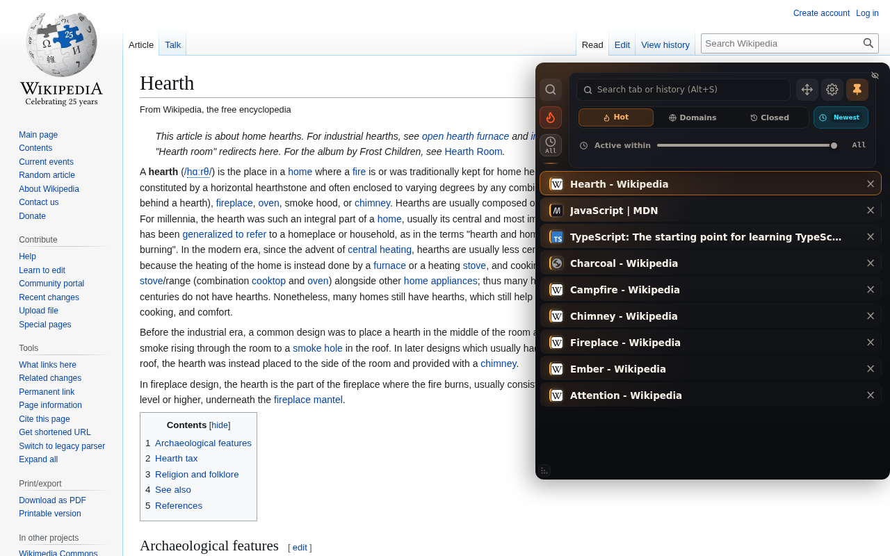
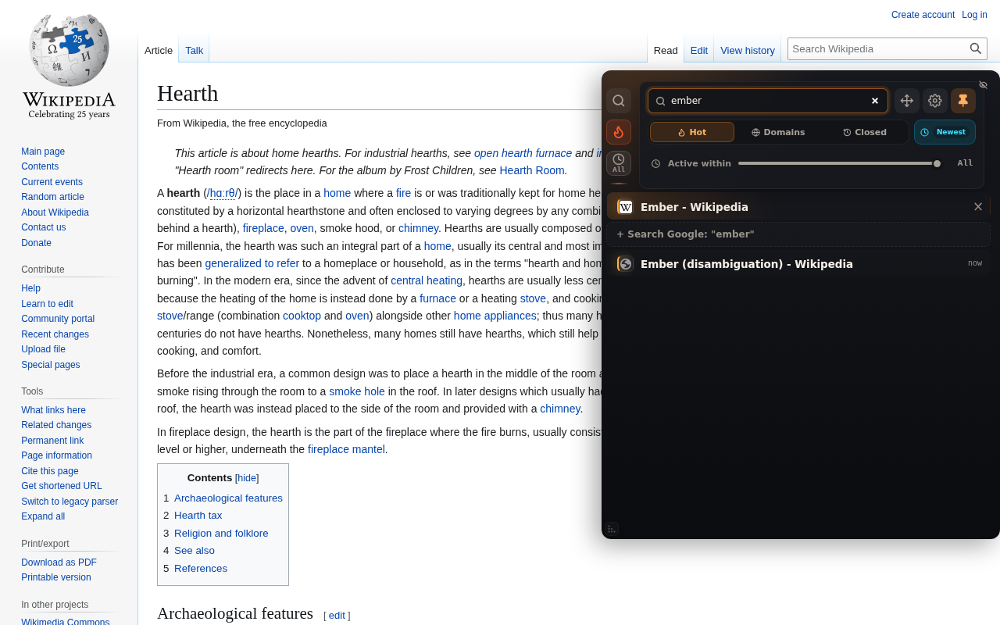
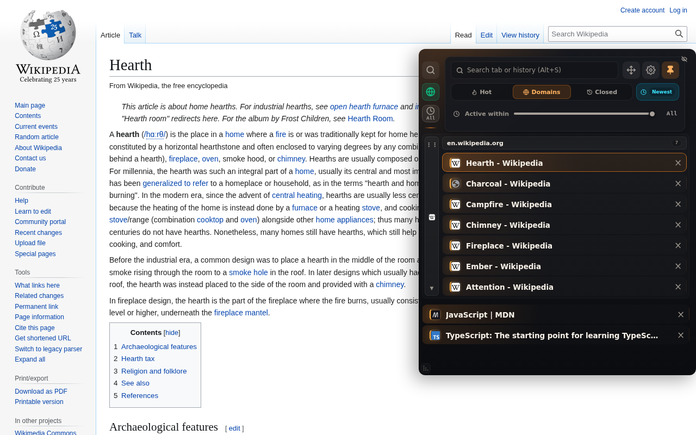

  <picture>
    <source media="(prefers-color-scheme: dark)" srcset="assets/vatra-lockup-dark.svg">
    
  </picture>

<strong>Keep your work warm.</strong>

  A Chrome side panel for your tabs, ordered by the attention they actually get. 
  Private, local, instant — no account, no sync, no server.

  <a href="https://vyshni-labs.github.io/vatra-tab-manager/">Website</a> ·
  <a href="https://vyshni-labs.github.io/vatra-tab-manager/privacy.html">Privacy</a> ·
  <a href="https://vyshni-labs.github.io/vatra-tab-manager/changelog.html">Changelog</a> ·
  <a href="https://vyshni-labs.github.io/vatra-tab-manager/uninstall.html">Feedback</a>

---

## Never lose your train of thought

The tabs you keep coming back to stay warm and close at hand. The ones you've
forgotten cool off, drop down the list, and can go to sleep to free memory.

*Vatra* is a word used across Ukraine and Southeast Europe for a hearth or
campfire — a place you gather around, leave, and return to while the fire is
kept alive.

## What it does

### Sorted by real attention, not by tab order

Every tab carries a score built from how often you return to it and how
recently, decaying on a 14-day half-life you can tune. The warm ones float up.
A colored heat bar shows each tab's age at a glance.

### Search tabs and history in one box

Open tabs match first; recently closed pages from local history follow
underneath. Enter jumps to the best match. History is read on your device and
never leaves it.

### Group by site

The Domains view collects tabs by origin with a live count per group. Drag the
side bars — or Alt+arrow — to reorder.

### Reach it without breaking flow

A thin strip rests at the edge of the page and expands on direct hover, or on
the scrollbar beside it. **Alt+S** opens it anywhere with search already
focused. Prefer Chrome's built-in sidebar? Switch in Settings → Panel type.

### Let cold tabs sleep

Background tabs untouched past a threshold are discarded to reclaim memory —
never the active, pinned, or audio-playing ones — and reload instantly when you
come back.

## Install

vatra is awaiting review on the Chrome Web Store; this section will carry the
listing link once it's live.

## Privacy

Your tabs, history, and settings never leave your browser. There is no
analytics, telemetry, profiling, or tracking of any kind, and nothing is ever
sold or shared.

The one exception is the feedback box in Settings: if you type a message and
press Submit, that message and your optional email are sent to a form relay so
they reach the developer. Nothing else is attached, and nothing is sent unless
you press the button. Full detail in the
[privacy policy](https://vyshni-labs.github.io/vatra-tab-manager/privacy.html).

| Permission | Why |
|------------|-----|
| `tabs` | Lists, activates, pins and closes your open tabs — the product itself |
| `history` | Local search for reopen suggestions under the search box |
| `storage` | Settings and per-tab activity scores |
| `sidePanel` | The native-sidebar mode |
| `alarms` | The periodic tab-sleep sweep |
| `favicon` | Site icons via Chrome's internal cache, so no icon CDN is contacted |

## About this repository

This repo holds vatra's public pages, served via GitHub Pages. The extension
source lives separately.

| Page | Purpose |
|------|---------|
| [`index.html`](https://vyshni-labs.github.io/vatra-tab-manager/) | Landing page |
| [`privacy.html`](https://vyshni-labs.github.io/vatra-tab-manager/privacy.html) | Privacy policy — the URL given to the Chrome Web Store |
| [`support.html`](https://vyshni-labs.github.io/vatra-tab-manager/support.html) | Support page — the URL given to the Chrome Web Store |
| [`changelog.html`](https://vyshni-labs.github.io/vatra-tab-manager/changelog.html) | Release notes |
| [`uninstall.html`](https://vyshni-labs.github.io/vatra-tab-manager/uninstall.html) | Exit survey opened on uninstall |

Static HTML and CSS with no third-party scripts. The only network call anywhere
on the site is the support and exit-survey form POST, and only when a visitor
submits one.

`changelog.html` is the one generated file — it is built from `CHANGELOG.md` in
the extension repo so the two can't drift. Edit the markdown there, not the HTML
here.

## Contact

Something broken or missing? There's a feedback box in the extension's settings
panel, or email <vyshni.labs@gmail.com>.

## License

[MIT](LICENSE) © 2026 Vyshni labs
